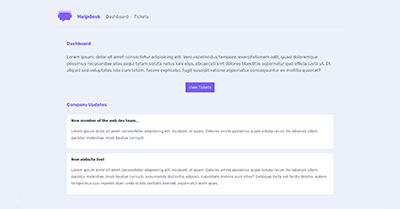
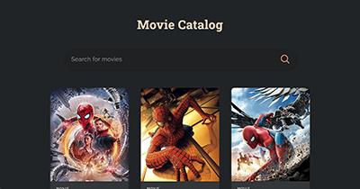
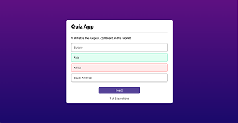
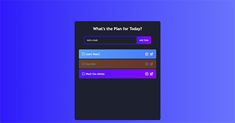
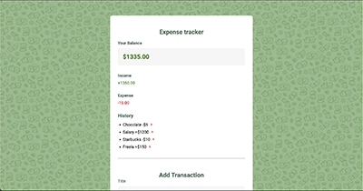
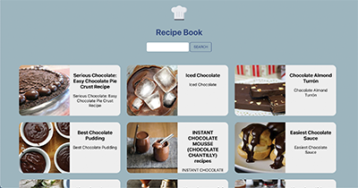
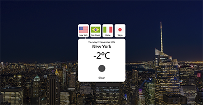

|  | Project | Description | Date | Technology |
| ---          |     ---    |          --- | ---          | ---          |
|  | <a href="https://andressabertolini.com/project/react-short-projects/helpdesk-app" target="_blank">Helpdesk App</a> | See tickets (this is an static export of the original project) | Dec 21, 2024 |  Next.js |
|  | <a href="https://andressabertolini.com/project/react-short-projects/movie-catalog-app" target="_blank">Movie Catalog App</a> | 🎥 Displays a movie catalog from the <a href="https://www.omdbapi.com/">OMDb API</a>. You can search for movies by title and access their pages, which contains information such as actors, awards and more. | Dec 03, 2024 |  React |
|  | <a href="https://andressabertolini.com/project/react-short-projects/quiz-app" target="_blank">Quiz App</a> | ✅ Grabs questions from an array and displays one at a time. When clicking it gives a feedback of if the answer is correct or not. At the end of the game displays a scores and a custom message according to the result | Nov 27, 2024 |  React |
|  | <a href="https://andressabertolini.com/project/react-short-projects/todo-list-app" target="_blank">Todo List App</a> | 📝 Add tasks in a list with the option to complete, delete or edit it  | Jan 29, 2021 |  React |
| | <a href="https://andressabertolini.com/project/react-short-projects/expense-tracker-app/" target="_blank">Expense Tracker App</a> | 💵 Add expenses and incomes to an array. Displays the balance and the transactions history | Jan 01, 2021 |  React |
|  | <a href="https://andressabertolini.com/project/react-short-projects/recipe-app/" target="_blank">Recipe App</a> | 👩🏼‍🍳 List recipes from an API and has a search field where you can search for specific recipes | Dec 12, 2020 |  React |
| | <a href="https://andressabertolini.com/project/react-short-projects/weather-app/" target="_blank">Weather App</a> | 🌦 Fetch data from a weather API and changes the background image according to it for 4 different cities in different countries | Dec 09, 2020 |  React |